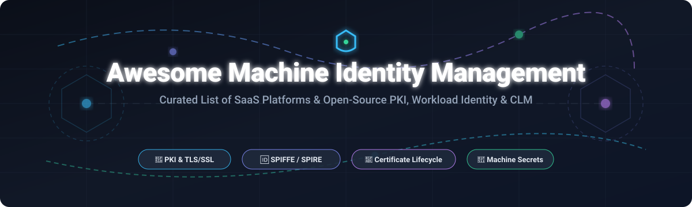

  

  
  
  
  
  

# 🔐 Awesome Machine Identity Management

> A curated list of top SaaS platforms, enterprise tools, and open-source projects for **Machine Identity Management (MIM)**, **Certificate Lifecycle Management (CLM)**, **Public Key Infrastructure (PKI)**, **SPIFFE/SPIRE Workload Identity**, and **Automated Secrets Rotation**.

---

## 📌 Table of Contents
- [📊 Market Overview &amp; Industry Analysis](#-market-overview--industry-analysis)
- [🏢 SaaS &amp; Enterprise Platforms](#-saas--enterprise-platforms)
- [💻 Open-Source GitHub Projects](#-open-source-github-projects)
- [🤝 How to Contribute](#-how-to-contribute)
- [💖 Support &amp; Community](#-support--community)
- [📈 Star History](#-star-history)
- [⚠️ Disclaimer](#%EF%B8%8F-disclaimer)

---

## 📊 Market Overview &amp; Industry Analysis

> **Estimated Sector Market Size**: The global Machine Identity Management (MIM) and Certificate Lifecycle Management (CLM) market is estimated at **$2.5 Billion – $4.2 Billion** in 2026, projected to reach **$9.1 Billion+ by 2032** at a **16.4% CAGR**.
> 
> **Market Structure**: The sector is **moderately fragmented**, led by dominant enterprise security consolidators (*CyberArk/Venafi, IBM/HashiCorp, Keyfactor, DigiCert*) alongside hyper-specialized cloud-native workload identity and private PKI engine providers.

---

## 🏢 SaaS &amp; Enterprise Platforms

*The following table categorizes commercial machine identity management and CLM solutions, sorted by **Company Size / Valuation / Revenue (Descending)**.*

| 🏢 Platform / SaaS Product | 💰 Company Size / Valuation | 🏷️ Starting Pricing | 🎁 Free Tier / Trial Limit | 🔐 Core Capabilities &amp; Summary |
| :--- | :--- | :--- | :--- | :--- |
| **[CyberArk / Venafi Machine Identity](https://www.venafi.com/)** | **$10.5B Market Cap** ($1.54B Venafi) | **$5,000 / year** (base tier for 500 identities) | **30-day free trial** (up to 250 certificates) | Enterprise platform for multi-cloud certificate discovery, policy enforcement, TLS/SSH governance, and workload identity. |
| **[HashiCorp Vault / HCP Vault](https://www.hashicorp.com/products/vault)** | **$6.4B Acquisition** ($583M ARR) | **$0.03 / hour** (~$21.90/mo Starter tier) | **30-day free trial** + $50 credits &amp; 250 active clients free | Centralized secrets management and PKI secrets engine providing dynamic short-lived certificates and automated credential rotation. |
| **[Keyfactor Command](https://www.keyfactor.com/)** | **$1.3B Valuation** (~$150M ARR) | **$3,600 / year** ($300/mo for 250 endpoints) | **Free Sandbox Tier** (up to 500 active certs) | CA-agnostic certificate lifecycle management (CLM) &amp; enterprise PKI orchestration powered by built-in EJBCA engine. |
| **[DigiCert Trust Lifecycle Manager](https://www.digicert.com/)** | **$1.2B Annual Rev** (~$8B Valuation) | **$2,499 / year** (for 100 managed certs) | **30-day free trial** (unlimited discovery &amp; 25 test certs) | CA-backed digital trust management combining public/private CA issuance, continuous discovery, and lifecycle policy controls. |
| **[Teleport Infrastructure Identity](https://goteleport.com/)** | **$1.1B Valuation** ($110M raised) | **$15 / user / mo** ($50/node/mo for workloads) | **14-day free trial** (or 100% free self-hosted Community) | Zero-trust infrastructure identity platform offering passwordless machine identity, short-lived SSH/TLS certs, and access proxies. |
| **[Fortanix Data Security Manager](https://fortanix.com/)** | **$600M Valuation** ($122M raised) | **$250 / month** ($3,000/yr for 2 virtual HSMs) | **30-day free trial** (10 key objects &amp; 100K API calls) | Confidential computing platform delivering hardware-backed PKI key management, HSM protection, and cross-cloud machine credential security. |
| **[Sectigo Certificate Manager (SCM)](https://sectigo.com/)** | **$500M Valuation** (~$180M ARR) | **$1,800 / year** (SCM Express for 50 certs) | **30-day free trial** (discovery + 10 test SSL certs) | Cloud-native automated certificate discovery and lifecycle management suite supporting ACME, SCEP, EST, and DevOps integrations. |
| **[AppViewX CERT+](https://www.appviewx.com/)** | **$250M Valuation** (Brighton Park) | **$2,000 / year** (for 100 managed endpoints) | **30-day free trial** (discovery scan up to 50 certs) | Low-code certificate lifecycle orchestration and crypto-agility platform featuring deep network infrastructure and ADC automation. |
| **[Smallstep Certificate Manager](https://smallstep.com/)** | **$150M Valuation** ($26M Series A) | **$99 / month** (Advanced SaaS for 100 hosts) | **Free Tier Forever** (up to 10 hosts &amp; 100 certs) | Managed step-ca platform automating internal DevOps PKI, SPIFFE SVIDs, SSH certificates, and ACME certificate issuance. |

---

## 💻 Open-Source GitHub Projects

*High-impact open-source tools for building custom, transparent, and resilient Machine Identity Infrastructure. Sorted by **GitHub Star Count (Descending)**.*

- **[HashiCorp Vault](https://github.com/hashicorp/vault)**   
  *36,200+ ⭐* — Open-source secrets management and PKI engine for dynamic X.509 certificate issuance, lease-based credentials, and cryptographic key protection.

- **[Certbot](https://github.com/certbot/certbot)**   
  *33,200+ ⭐* — The EFF's automated ACME client for issuing and renewing Let's Encrypt TLS certificates across web servers and cloud services.

- **[Teleport Community Edition](https://github.com/gravitational/teleport)**   
  *20,900+ ⭐* — Identity-aware access proxy and certificate authority for machine SSH, Kubernetes nodes, databases, and internal web applications.

- **[cert-manager](https://github.com/cert-manager/cert-manager)**   
  *14,000+ ⭐* — Cloud-native Kubernetes certificate management controller automating TLS issuance from Let's Encrypt, step-ca, Vault, and Venafi.

- **[lego](https://github.com/go-acme/lego)**   
  *9,800+ ⭐* — Pure Go ACME client library and CLI supporting automated DNS-01 challenge integrations across 80+ DNS providers.

- **[CFSSL (Cloudflare PKI Toolkit)](https://github.com/cloudflare/cfssl)**   
  *9,400+ ⭐* — Cloudflare's open-source PKI toolkit and HTTP API server for certificate signing, verification, and TLS bundle creation.

- **[step-ca (Smallstep Certificates)](https://github.com/smallstep/certificates)**   
  *8,800+ ⭐* — Modern, lightweight private Certificate Authority designed for automated certificate management (ACME, SSH, OIDC, SCEP, and OAuth2).

- **[OpenBao](https://github.com/openbao/openbao)**   
  *7,400+ ⭐* — Community-driven open-source fork of HashiCorp Vault managed under the Linux Foundation for secrets and PKI governance.

- **[External Secrets Operator](https://github.com/external-secrets/external-secrets)**   
  *6,800+ ⭐* — Kubernetes operator integrating external secret management systems (Vault, AWS Secrets Manager, GCP Secret Manager) with K8s secrets.

- **[Boulder (Let's Encrypt CA)](https://github.com/letsencrypt/boulder)**   
  *5,700+ ⭐* — The open-source ACME-based Certificate Authority software powering Let's Encrypt and private enterprise ACME infrastructure.

- **[SPIRE (SPIFFE Runtime Environment)](https://github.com/spiffe/spire)**   
  *2,500+ ⭐* — CNCF-graduated production implementation of the SPIFFE standard for issuing short-lived SVIDs to heterogeneous workload identities.

- **[Lemur (Netflix Certificate Manager)](https://github.com/Netflix/lemur)**   
  *1,700+ ⭐* — Netflix's open-source certificate management orchestration tool designed for tracking, creating, and rotating TLS/SSL certificates across multi-CA estates.

- **[EJBCA Community Edition](https://github.com/Keyfactor/ejbca-ce)**   
  *940+ ⭐* — Enterprise-grade open-source PKI and Certificate Authority software supporting CRL, OCSP, CMP, EST, and hardware security modules (HSMs).

- **[cert-exporter](https://github.com/joe-elliott/cert-exporter)**   
  *380+ ⭐* — Prometheus exporter for monitoring TLS certificate expiration across Kubernetes secrets, files, and local certificates.

- **[cert-manager CSI Driver SPIFFE](https://github.com/cert-manager/csi-driver-spiffe)**   
  *80+ ⭐* — Kubernetes CSI driver mounting ephemeral SPIFFE-compliant X.509 SVID credentials directly into pod volumes.

---

## 🤝 How to Contribute

Contributions are warmly welcome! To submit a new tool, SaaS platform, or open-source project:

1. 🍴 Fork the repository.
2. 📝 Add your entry under the appropriate section in `README.md`.
3. 🔗 Maintain alphabetical or sorted ordering and include factual details (pricing, star badges, descriptions).
4. 🚀 Open a Pull Request with a clear summary of changes.

Check out [Awesome-Awesome-Awesome](https://github.com/ishandutta2007/Awesome-Awesome-Awesome) for more curated lists!

---

## 💖 Support &amp; Community

If you find this repository helpful, please consider supporting the project!

- ⭐ **Star** this repository to increase visibility.
- 🔀 **Fork** and share with fellow DevOps, security, and SRE professionals.
- ☕ **Buy me a coffee / Sponsor**: Support ongoing maintenance via [GitHub Sponsors](https://github.com/sponsors/ishandutta2007).

---

## 📈 Star History

---

## ⚠️ Disclaimer

- This list is community-curated for informational purposes and does not imply official endorsement.
- Machine Identity systems handle sensitive credentials (TLS keys, SSH host certificates, SPIFFE SVIDs). Always conduct independent security audits, verify key storage security (HSM/KMS), and enforce short-lived certificate rotation policies in production.
